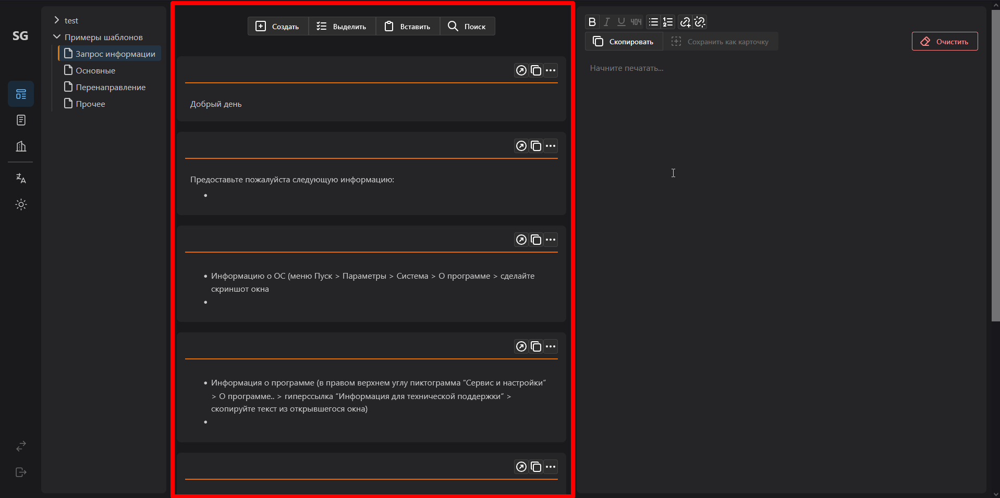

# README

## Описание

Web-приложение предоставляет функционал для работы с шаблонами ответов, операторами электронного документооборота (ЭДО) и поиска идентификаторов ЭДО организаций по ИНН.

## Страницы приложения

### 1. Страница с шаблонами ответов

#### Explorer
Explorer в левой части окна предоставляет возможность:
- создавать папки и коллекции шаблонов;
- управлять элементами через контекстное меню.


**Доступные действия:**
- **В корне Explorer:** создание коллекций и папок, вставка скопированных элементов.
- **Для коллекций:** копирование, переименование, удаление.
- **Для папок:** все действия, доступные для коллекций, плюс управление вложениями.

Элементы Explorer можно перемещать, удерживая ЛКМ, а также выделять несколько элементов с помощью Ctrl + ЛКМ.

#### Список шаблонов
В центральной части отображается список шаблонов активной коллекции.



**Опции для карточки шаблона:**
- перенести текст шаблона в редактор;
- копировать содержимое в буфер обмена;
- редактировать шаблон;
- выделить/скопировать/удалить карточку.

**Панель инструментов:**
- создание новой карточки;
- выбор нескольких карточек для массовой обработки;
- вставка скопированных карточек;
- поиск по карточкам активной коллекции или всем карточкам системы.

#### Редактор
В правой части страницы расположен текстовый редактор для комбинирования текстов шаблонов.


**Основные опции:**
- копирование текста;
- очистка редактора.

### 2. Страница с информацией об операторах ЭДО


**Источник данных:**
Данные на этой странице берутся из Excel-таблицы, доступной по [ссылке](https://www.nalog.gov.ru/rn77/taxation/submission_statements/el_count/#t2).

**Панель инструментов:**
- отобразить/скрыть список избранных операторов;
- отобразить/скрыть информацию о странице.

**Функционал для каждого оператора:**
- добавление в избранное;
- копирование email;
- просмотр подробной информации.

### 3. Страница для поиска идентификаторов ЭДО по ИНН

**Описание функционала:**
Эта страница позволяет получать данные об организации от СКБ Контур без ручной обработки файлов.


После ввода ИНН и выполнения запроса отображается таблица с информацией об организации (КПП, ID ЭДО, наименование, статус).


**Дополнительные возможности:**
- Копирование содержимого ячеек таблицы в буфер обмена по клику.


## Комбинации клавиш

### Поиск:
- `Ctrl + F` - поиск по активной коллекции.
- `Ctrl + Shift + F` - поиск по всем коллекциям.
- `Esc` - выход из режима поиска.

### Редактор:
- `Ctrl + K` - вставка ссылки.
- `Esc` - выход из режима создания ссылки.

### Страница "Информация об организации":
- `Alt + I` - активация поля для ввода ИНН.
- `Enter` - отправка запроса с указанным ИНН.
- `Esc` - выход из режима редактирования ИНН.

<!-- ## Системные требования
- Современный веб-браузер (Google Chrome, Mozilla Firefox, Microsoft Edge).
- Подключение к интернету.

## Установка и запуск
1. Склонируйте репозиторий:
   ```bash
   git clone https://github.com/your-repo-name.git
   ```
2. Установите зависимости (если применимо):
   ```bash
   npm install
   ```
3. Запустите приложение:
   ```bash
   npm start
   ``` -->

<!-- ## Лицензия -->

